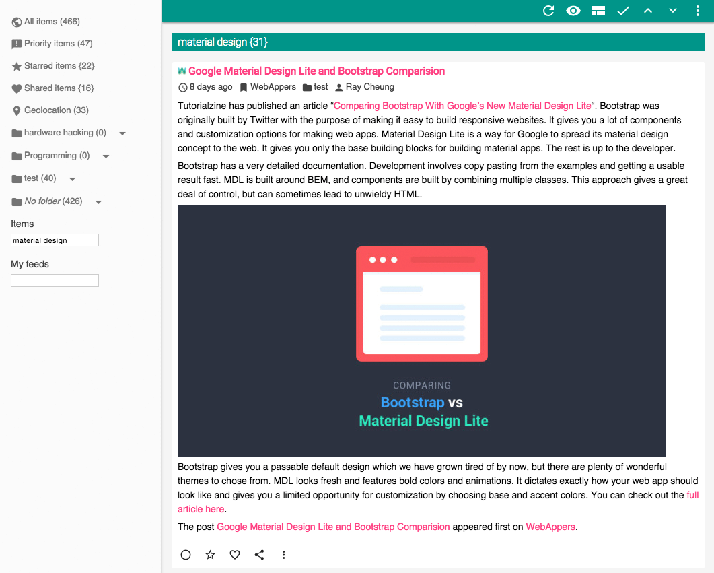

### Demo

http://readerself.com/demo/
```text
example@example.com
example
```

### Install

Edit [/application/config/readerself_config.php](/application/config/readerself_config.php) to define "salt_password" (some letters and numbers to secure your password)

Edit [/application/config/database.php](/application/config/database.php) to define "username", "password" and "database" ("hostname" if necessary)

Load SQL commands from [/INSTALL.sql](/INSTALL.sql) in your database

Launch in a browser to register an account

Add to cron (hourly) => cd /path-to-installation && php index.php refresh items

### Third party

* [CodeIgniter](http://ellislab.com/codeigniter/)
* [SimplePie](http://simplepie.org)
* [jQuery](http://jquery.com/)
* [Font Awesome](http://fortawesome.github.io/Font-Awesome/)
* [UASparser](https://github.com/Synchro/UASparser)
* [FeedWriter](https://github.com/ajaxray/FeedWriter)
