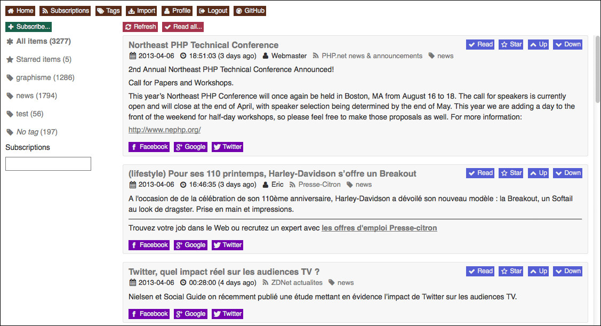
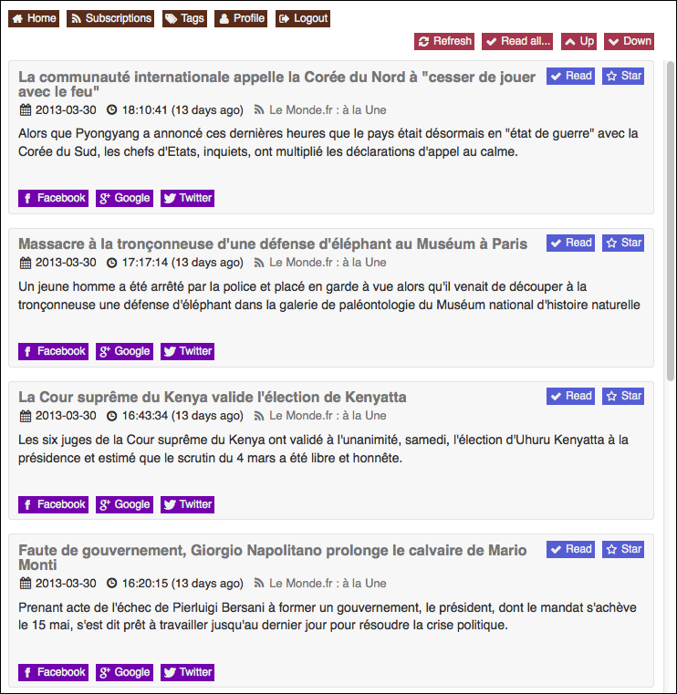
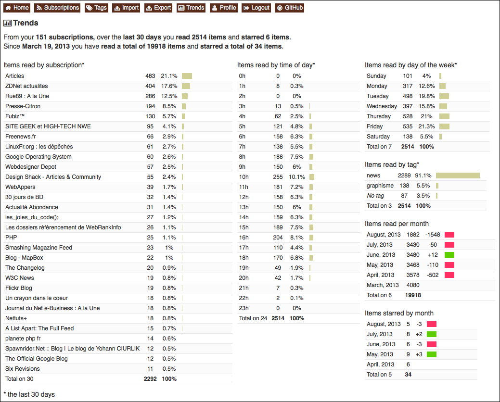

### Demo

http://readerself.com/
```text
example@example.com
example
```

### Screenshots






### Third party

* [CodeIgniter](http://ellislab.com/codeigniter/)
* [SimplePie](http://simplepie.org)
* [jQuery](http://jquery.com/)
* [Font Awesome](http://fortawesome.github.io/Font-Awesome/)

### Status

* CSS: 90%
* HTML: 90%
* JavaScript: 80%
* PHP: 80%
* SQL: 80%

### Features

* Responsive desktop, tablet and mobile
* Add a feed
* Import and export OPML
* Get items (cron)
* Folders (optional)
* Trends
* Switch Unread only / Read and unread
* Expand / Collapse items
* Display image enclosures
* Starred items (optional)
* Share to Facebook, Google and Twitter (optional)
* Search subscriptions
* Search items (title only right now)
* Main keyboard shortcuts from Google Reader
* Register multi-users (optional)
* Live unread counter in title bar / tab

### Setup

Edit [/application/config/reader_config.php](/application/config/reader_config.php) to define "salt_password" (some letters and numbers to secure your password)

Edit [/application/config/database.php](/application/config/database.php) to define "username", "password" and "database" ("hostname" if necessary)

Load SQL commands below in your database

Launch in a browser to register an account

Add to cron (hourly) => cd /path-to-installation && php index.php refresh items

```sql
CREATE TABLE IF NOT EXISTS `connections` (
  `cnt_id` bigint(20) unsigned NOT NULL AUTO_INCREMENT,
  `mbr_id` bigint(20) unsigned NOT NULL,
  `token_connection` char(40) DEFAULT NULL,
  `cnt_ip` varchar(255) DEFAULT NULL,
  `cnt_agent` varchar(255) NOT NULL,
  `cnt_datecreated` datetime NOT NULL,
  PRIMARY KEY (`cnt_id`),
  UNIQUE KEY `token_connection` (`token_connection`),
  KEY `mbr_id` (`mbr_id`)
) ENGINE=MyISAM  DEFAULT CHARSET=utf8;

CREATE TABLE IF NOT EXISTS `enclosures` (
  `enr_id` bigint(20) unsigned NOT NULL AUTO_INCREMENT,
  `itm_id` bigint(20) unsigned NOT NULL,
  `enr_link` varchar(255) NOT NULL,
  `enr_type` varchar(255) NOT NULL,
  `enr_length` int(10) unsigned NOT NULL,
  `enr_datecreated` datetime NOT NULL,
  PRIMARY KEY (`enr_id`),
  KEY `itm_id` (`itm_id`)
) ENGINE=MyISAM  DEFAULT CHARSET=utf8;

CREATE TABLE IF NOT EXISTS `favorites` (
  `fav_id` bigint(20) unsigned NOT NULL AUTO_INCREMENT,
  `mbr_id` bigint(20) unsigned NOT NULL,
  `itm_id` bigint(20) unsigned NOT NULL,
  `fav_datecreated` datetime NOT NULL,
  PRIMARY KEY (`fav_id`),
  KEY `mbr_id` (`mbr_id`),
  KEY `itm_id` (`itm_id`)
) ENGINE=MyISAM  DEFAULT CHARSET=utf8;

CREATE TABLE IF NOT EXISTS `feeds` (
  `fed_id` bigint(20) unsigned NOT NULL AUTO_INCREMENT,
  `fed_title` varchar(255) DEFAULT NULL,
  `fed_url` varchar(255) DEFAULT NULL,
  `fed_link` varchar(255) NOT NULL,
  `fed_image` varchar(255) DEFAULT NULL,
  `fed_description` text,
  `fed_lasterror` varchar(255) DEFAULT NULL,
  `fed_datecreated` datetime NOT NULL,
  PRIMARY KEY (`fed_id`),
  KEY `fed_link` (`fed_link`)
) ENGINE=MyISAM  DEFAULT CHARSET=utf8;

CREATE TABLE IF NOT EXISTS `folders` (
  `flr_id` bigint(20) unsigned NOT NULL AUTO_INCREMENT,
  `mbr_id` bigint(20) unsigned NOT NULL,
  `flr_title` varchar(255) NOT NULL,
  `flr_datecreated` datetime NOT NULL,
  PRIMARY KEY (`flr_id`),
  KEY `mbr_id` (`mbr_id`),
  KEY `flr_title` (`flr_title`)
) ENGINE=MyISAM  DEFAULT CHARSET=utf8;

CREATE TABLE IF NOT EXISTS `history` (
  `hst_id` bigint(20) unsigned NOT NULL AUTO_INCREMENT,
  `mbr_id` bigint(20) unsigned NOT NULL,
  `itm_id` bigint(20) unsigned NOT NULL,
  `hst_real` tinyint(1) unsigned NOT NULL DEFAULT '1',
  `hst_datecreated` datetime NOT NULL,
  PRIMARY KEY (`hst_id`),
  KEY `mbr_id` (`mbr_id`),
  KEY `itm_id` (`itm_id`),
  KEY `hst_real` (`hst_real`)
) ENGINE=MyISAM  DEFAULT CHARSET=utf8;

CREATE TABLE IF NOT EXISTS `items` (
  `itm_id` bigint(20) unsigned NOT NULL AUTO_INCREMENT,
  `fed_id` bigint(20) unsigned NOT NULL,
  `itm_title` varchar(255) NOT NULL,
  `itm_link` varchar(255) NOT NULL,
  `itm_author` varchar(255) DEFAULT NULL,
  `itm_content` text NOT NULL,
  `itm_date` datetime NOT NULL,
  `itm_datecreated` datetime NOT NULL,
  PRIMARY KEY (`itm_id`),
  KEY `fed_id` (`fed_id`),
  KEY `itm_link` (`itm_link`),
  KEY `itm_date` (`itm_date`)
) ENGINE=MyISAM  DEFAULT CHARSET=utf8;

CREATE TABLE IF NOT EXISTS `members` (
  `mbr_id` bigint(20) unsigned NOT NULL AUTO_INCREMENT,
  `mbr_email` varchar(255) NOT NULL,
  `mbr_password` char(40) NOT NULL,
  `token_password` char(40) DEFAULT NULL,
  `token_share` char(40) DEFAULT NULL,
  `mbr_datecreated` datetime NOT NULL,
  PRIMARY KEY (`mbr_id`),
  UNIQUE KEY `mbr_email` (`mbr_email`),
  UNIQUE KEY `token_password` (`token_password`)
) ENGINE=MyISAM  DEFAULT CHARSET=utf8;

CREATE TABLE IF NOT EXISTS `share` (
  `shr_id` bigint(20) unsigned NOT NULL AUTO_INCREMENT,
  `mbr_id` bigint(20) unsigned NOT NULL,
  `itm_id` bigint(20) unsigned NOT NULL,
  `shr_datecreated` datetime NOT NULL,
  PRIMARY KEY (`shr_id`),
  KEY `mbr_id` (`mbr_id`),
  KEY `itm_id` (`itm_id`)
) ENGINE=MyISAM  DEFAULT CHARSET=utf8;

CREATE TABLE IF NOT EXISTS `subscriptions` (
  `sub_id` bigint(20) unsigned NOT NULL AUTO_INCREMENT,
  `mbr_id` bigint(20) unsigned NOT NULL,
  `fed_id` bigint(20) unsigned NOT NULL,
  `flr_id` bigint(20) unsigned DEFAULT NULL,
  `sub_title` varchar(255) DEFAULT NULL,
  `sub_datecreated` datetime NOT NULL,
  PRIMARY KEY (`sub_id`),
  KEY `mbr_id` (`mbr_id`),
  KEY `fed_id` (`fed_id`),
  KEY `flr_id` (`flr_id`)
) ENGINE=MyISAM  DEFAULT CHARSET=utf8;
```

#### Update

##### 2013-08-24

```sql
ALTER TABLE `history` ADD `hst_real` TINYINT( 1 ) UNSIGNED NOT NULL DEFAULT '1' AFTER `itm_id`;
ALTER TABLE `history` ADD INDEX ( `hst_real` );
ALTER TABLE `subscriptions` ADD `sub_title` VARCHAR( 255 ) NULL AFTER `tag_id`;
```

##### 2013-08-25

```sql
ALTER TABLE `feeds` ADD `fed_image` VARCHAR( 255 ) NULL AFTER `fed_link`;
CREATE TABLE IF NOT EXISTS `enclosures` (
  `enr_id` bigint(20) unsigned NOT NULL AUTO_INCREMENT,
  `itm_id` bigint(20) unsigned NOT NULL,
  `enr_link` varchar(255) NOT NULL,
  `enr_type` varchar(255) NOT NULL,
  `enr_datecreated` datetime NOT NULL,
  PRIMARY KEY (`enr_id`),
  KEY `itm_id` (`itm_id`)
) ENGINE=MyISAM  DEFAULT CHARSET=utf8;
ALTER TABLE `feeds` CHANGE `fed_title` `fed_title` VARCHAR( 255 ) CHARACTER SET utf8 COLLATE utf8_general_ci NULL,
CHANGE `fed_url` `fed_url` VARCHAR( 255 ) CHARACTER SET utf8 COLLATE utf8_general_ci NULL;
ALTER TABLE `feeds` DROP INDEX `fed_lasterror`;
```

##### 2013-08-29

```sql
RENAME TABLE `tags` TO `folders`;
ALTER TABLE `folders` CHANGE `tag_id` `flr_id` BIGINT( 20 ) UNSIGNED NOT NULL AUTO_INCREMENT,
CHANGE `tag_title` `flr_title` VARCHAR( 255 ) CHARACTER SET utf8 COLLATE utf8_general_ci NOT NULL,
CHANGE `tag_datecreated` `flr_datecreated` DATETIME NOT NULL;
ALTER TABLE `subscriptions` CHANGE `tag_id` `flr_id` BIGINT( 20 ) UNSIGNED NULL DEFAULT NULL;
CREATE TABLE IF NOT EXISTS `share` (
  `shr_id` bigint(20) unsigned NOT NULL AUTO_INCREMENT,
  `mbr_id` bigint(20) unsigned NOT NULL,
  `itm_id` bigint(20) unsigned NOT NULL,
  `shr_datecreated` datetime NOT NULL,
  PRIMARY KEY (`shr_id`),
  KEY `mbr_id` (`mbr_id`),
  KEY `itm_id` (`itm_id`)
) ENGINE=MyISAM  DEFAULT CHARSET=utf8;
```

##### 2013-08-30

```sql
ALTER TABLE `enclosures` ADD `enr_length` INT UNSIGNED NOT NULL AFTER `enr_type`;
ALTER TABLE `members` ADD `token_share` CHAR( 40 ) NULL DEFAULT NULL AFTER `token_password`;
```
