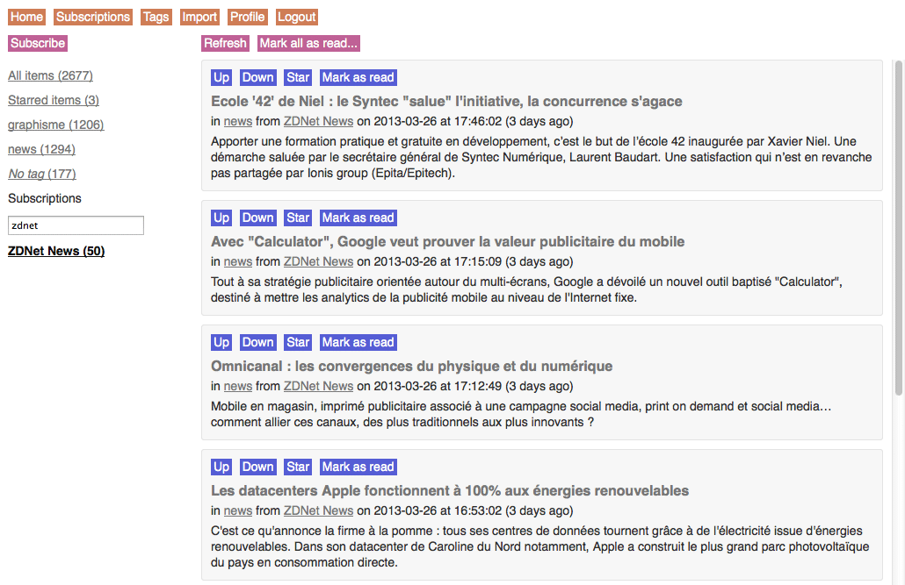

# Demo

http://sdion.net/reader/
```text
example@example.com
example
```

# Screenshots



# Third party

* [CodeIgniter](http://ellislab.com/codeigniter/)
* [SimplePie](http://simplepie.org)
* [jQuery](http://jquery.com/)

# Status

* CSS: 90%
* HTML: 90%
* JavaScript: 75%
* PHP: 70%

# Keyboard shortcuts

* esc: close modal window
* r: refresh
* a: add a subscription
* shift+a: mark all as read
* g then a: go to all items
* g then s: go to starred items


# Setup

Edit /application/config/reader_config.php to define "salt_password" (some letters and numbers to secure your password)

Edit /application/config/database.php to define "username", "password" and "database" ("hostname" if necessary)

Load SQL commands below in your database

Launch in a browser to register an account

Add to cron at least hourly index.php refresh items

```sql
CREATE TABLE IF NOT EXISTS `connections` (
  `cnt_id` bigint(20) unsigned NOT NULL AUTO_INCREMENT,
  `mbr_id` bigint(20) unsigned NOT NULL,
  `token_connection` char(40) DEFAULT NULL,
  `cnt_ip` varchar(255) DEFAULT NULL,
  `cnt_agent` varchar(255) NOT NULL,
  `cnt_datecreated` datetime NOT NULL,
  PRIMARY KEY (`cnt_id`),
  UNIQUE KEY `token_connection` (`token_connection`),
  KEY `mbr_id` (`mbr_id`)
) ENGINE=MyISAM  DEFAULT CHARSET=utf8;

CREATE TABLE IF NOT EXISTS `favorites` (
  `fav_id` bigint(20) unsigned NOT NULL AUTO_INCREMENT,
  `mbr_id` bigint(20) unsigned NOT NULL,
  `itm_id` bigint(20) unsigned NOT NULL,
  `fav_datecreated` datetime NOT NULL,
  PRIMARY KEY (`fav_id`),
  KEY `mbr_id` (`mbr_id`),
  KEY `itm_id` (`itm_id`)
) ENGINE=MyISAM  DEFAULT CHARSET=utf8;

CREATE TABLE IF NOT EXISTS `feeds` (
  `fed_id` bigint(20) unsigned NOT NULL AUTO_INCREMENT,
  `fed_title` varchar(255) NOT NULL,
  `fed_url` varchar(255) NOT NULL,
  `fed_link` varchar(255) NOT NULL,
  `fed_description` text,
  `fed_lasterror` varchar(255) DEFAULT NULL,
  `fed_datecreated` datetime NOT NULL,
  PRIMARY KEY (`fed_id`),
  KEY `fed_link` (`fed_link`),
  KEY `fed_lasterror` (`fed_lasterror`)
) ENGINE=MyISAM  DEFAULT CHARSET=utf8;

CREATE TABLE IF NOT EXISTS `history` (
  `hst_id` bigint(20) unsigned NOT NULL AUTO_INCREMENT,
  `mbr_id` bigint(20) unsigned NOT NULL,
  `itm_id` bigint(20) unsigned NOT NULL,
  `hst_datecreated` datetime NOT NULL,
  PRIMARY KEY (`hst_id`),
  KEY `mbr_id` (`mbr_id`),
  KEY `itm_id` (`itm_id`)
) ENGINE=MyISAM  DEFAULT CHARSET=utf8;

CREATE TABLE IF NOT EXISTS `items` (
  `itm_id` bigint(20) unsigned NOT NULL AUTO_INCREMENT,
  `fed_id` bigint(20) unsigned NOT NULL,
  `itm_title` varchar(255) NOT NULL,
  `itm_link` varchar(255) NOT NULL,
  `itm_author` varchar(255) DEFAULT NULL,
  `itm_content` text NOT NULL,
  `itm_date` datetime NOT NULL,
  `itm_datecreated` datetime NOT NULL,
  PRIMARY KEY (`itm_id`),
  KEY `fed_id` (`fed_id`),
  KEY `itm_link` (`itm_link`),
  KEY `itm_date` (`itm_date`)
) ENGINE=MyISAM  DEFAULT CHARSET=utf8;

CREATE TABLE IF NOT EXISTS `members` (
  `mbr_id` bigint(20) unsigned NOT NULL AUTO_INCREMENT,
  `mbr_email` varchar(255) NOT NULL,
  `mbr_password` char(40) NOT NULL,
  `token_password` char(40) DEFAULT NULL,
  `mbr_datecreated` datetime NOT NULL,
  PRIMARY KEY (`mbr_id`),
  UNIQUE KEY `mbr_email` (`mbr_email`),
  UNIQUE KEY `token_password` (`token_password`)
) ENGINE=MyISAM  DEFAULT CHARSET=utf8;

CREATE TABLE IF NOT EXISTS `subscriptions` (
  `sub_id` bigint(20) unsigned NOT NULL AUTO_INCREMENT,
  `mbr_id` bigint(20) unsigned NOT NULL,
  `fed_id` bigint(20) unsigned NOT NULL,
  `tag_id` bigint(20) unsigned NULL,
  `sub_datecreated` datetime NOT NULL,
  PRIMARY KEY (`sub_id`),
  KEY `mbr_id` (`mbr_id`),
  KEY `fed_id` (`fed_id`)
) ENGINE=MyISAM  DEFAULT CHARSET=utf8;

CREATE TABLE IF NOT EXISTS `tags` (
  `tag_id` bigint(20) unsigned NOT NULL AUTO_INCREMENT,
  `mbr_id` bigint(20) unsigned NOT NULL,
  `tag_title` varchar(255) NOT NULL,
  `tag_datecreated` datetime NOT NULL,
  PRIMARY KEY (`tag_id`),
  KEY `mbr_id` (`mbr_id`),
  KEY `tag_title` (`tag_title`)
) ENGINE=MyISAM  DEFAULT CHARSET=utf8;
 ```
